## Traffic Sign Recognition 

### Overview

The goal of this project is to build a convolutional neural network (CNN) using Tensorflow to classify traffic signs. 

The project consists of following files : 

* `Project.ipynb` : IPython notebook with step-by-step description, implementation and execution of entire code. 

--

### Data
I have used [German Traffic Sign Dataset](http://benchmark.ini.rub.de/?section=gtsrb&subsection=dataset) where the bounding box locations and labels for  traffic signs are provided. Here is a random sample of images from each class : 
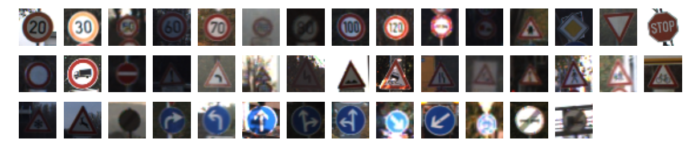

There are a total of 43 classes or labels in the dataset. Here is the distribution of classes in training and test set : 
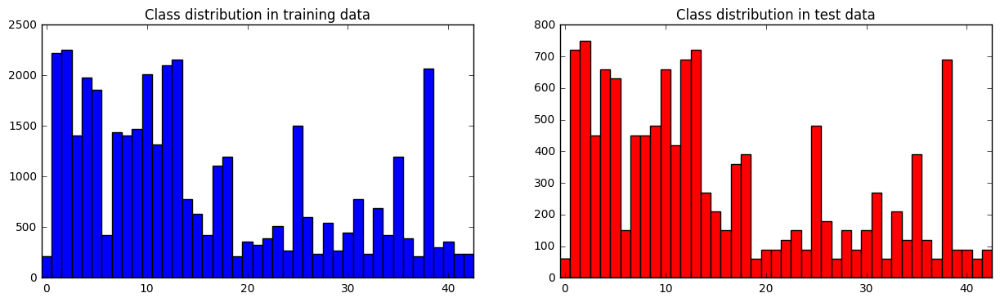
The class ditribution in train and test sets look very similar. Even if we did not balance dataset, it is possible to obtain a reasonable accuracy for this particular testset. However, for new test sets with different class distributions, accuracy will go down. Therefore, we will balance our training set later by data augmentation. 

There seems to be a significant variation in lighting for randomly chosen images within a class which I will address later. A majot issue one has to deal with is that pictures were taken in quick successions which introduces high correlation between images as shown below : 
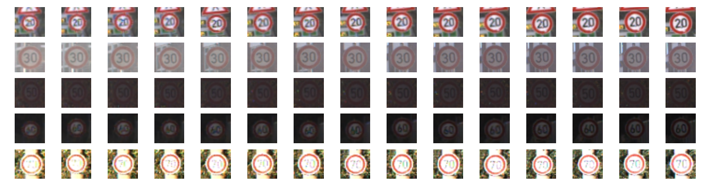

As explained above, this similarity arises because pictures were taken from the same vehicle at close intervals. We define such a group of images as a 'track' and we want to identify images which belong to the same track. This will be crucial because CNN trained on images in the same track will not be robust to new data. Further care has to be taken when we divide the data set into training and validation sets. Fortunately, images in the same track appear together in the dataset. Below is a plot showing how similar an image is compared to the previous image in the dataset :
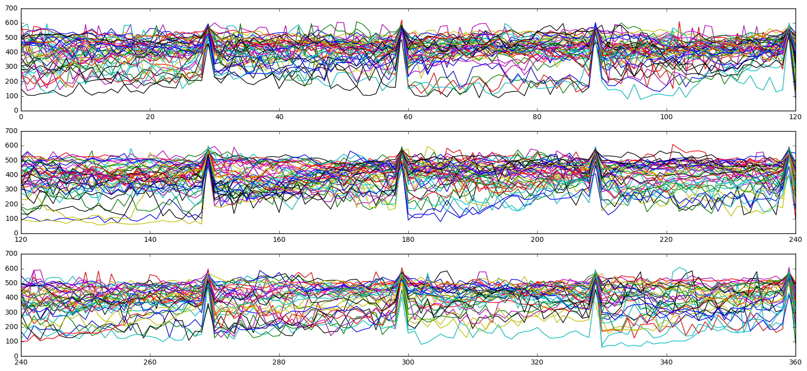 

The spikes clearly visible in the above dataset mark separation of tracks at intervals of 30 images. 
For robustness, it has to be ensured that images in the same track do not get divided between training and validation sets since they are very similar. For validation set, I randomly select 2 tracks per class from the entire training dataset (see code cell 14 of `Project.ipynb`). 

--

### Data preprocessing and augmentation

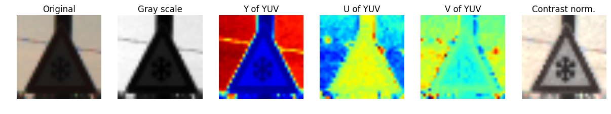

I tried several colorspaces, starting from original RGB followed by YUV where Y channel carries intensity information which was normalized for each image to adjust for variable lighting. I found that Y channel was almost identical to grayscale. However, this naive linear scaling is not always sufficient as evident in figure above where contrast adjustment makes a huge difference. After trial and error, I decided to use contrast limited adaptive histogram equilization (CLAHE) with tile size of 4x4. I used all color channels as this information is relevant for traffic signs. As a last step, I simply scaled RGB values to lie in the range [-0.5,0.5]. Note that actual pre-processing is applied after data augmentaion. For implementation, see code cell 13 of `Project.ipynb`.

Next, we need to generate fake data for several reasons : 
* To balance our dataset
* For training purposes, ideally we should have had lot of tracks and only a few images per track but this is not the case. 
* In general, small perturbations in our original dataset will increase robustness of CNNs later.

I generated fake data by performing geometric transformations (see code cells 15-18 of `Project.ipynb`). Here are some of the transformations I used :

* Scaling : chosen randoly between 0.85 and 1.1 for both x and y  directions.
* Translation : Random shift by at most 2 pixels in x/y directions.
* Rotation : Rotation by angle randomly chosen in the range (-17,17)
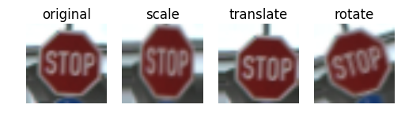

To augment data, a combination of the above transformations is used. Here is an example of random transformations on the same image :
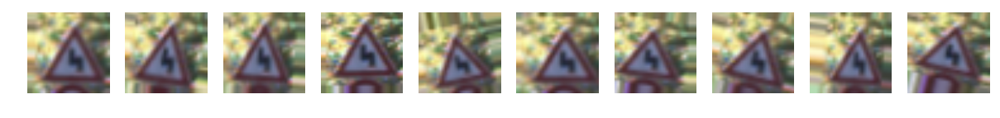

I apply random image transforms to every odd numbered image in training dataset with the idea being that consecutive images have similar resolution. Further, I augment existing dataset to make it balanced by requiring 3000 examples per class in training set. Here is the final class distributions after augmentation :
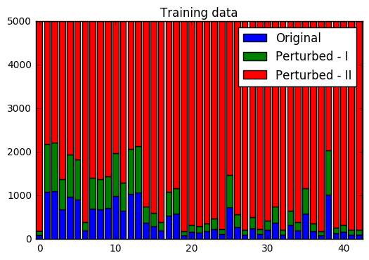

--

### CNN architecture
The model I have chosen is inspired by VGGnet architecture. Consider the following arrangement : 

* Conv. layer  
* ReLu activation
* Conv. layer 
* ReLu activation
* Pooling
* Dropout  

This arrangement is repeated 3 times so that we have a total of 6 conv layers. These layers have 32, 32, 64, 64, 128 and 128 filters in that order. Each conv. layer uses 3x3 filters with stride=1 and `padding=1`. Pooling layer uses maxpool filters of size 2x2 with `stride=2`. 
This is followed by following arrangement : 

* Full-connected layer
* ReLu activation
* Dropout  

repeated twice. Each fully-connected layers has size of 128. Softmax function is applied on final output layer for computing loss. 

Please see code cell 23 for implementation in Tensorflow and code cell 24 for training. 

I used Adam optimizer with learning rate = 0.007. Batch size of 64 was used and training was done for 30 epochs. The keep_prob for dropout layers was chosen to be 0.5 for conv layers and 0.7 for FC layers. 

* Starting with pre-processing stage, I tried several color channels including RGB, YUV and RGB with CLAHE. I chose RGB with CLAHE as it gave best results and I believe color carries useful information for our problem. 
* I chose architecture similar to VGGnet because deeper layers give better results and it is also quite elegant in the sense that same size filters for conv layers and pooling are used throughout. 
* `Padding=1` or `'SAME'` padding was used in conv layers to retain information at the borders of images.
* Batch size and the size of FC layers was mostly constrained by memory issues, and adding more neurons in FC layers didn't seem to help much with the accuracy.
* `keep_prob` in dropout for FC layers was chosen to be 0.7 because a smaller value of ~0.5 led to extremely slow convergence. 
* I used  Adam optimizer as it seems to automatically tune the learning rate with time. 

**A test set accuracy of 98.2% was obtained!** It is quite remarkable that VGGnet inspired CNN with only minor tweaks yields such a high test accuracy. 

Let us now plot the confusion matrix to see where the model actually fails. Note that we plot the log of confusion matrix due to very high accuracy.
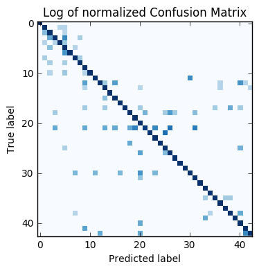

Some clusters can be observed in the confusion matrix above. It turns out that the various speed limits are sometimes misclassified among themselves. Similarly, traffic signs with traingular shape are misclassified among themselves. I believe the model can be further improved by using hierarchical CNNs to first identify broader groups like speed signs and then have CNNs to classify finer features such as the actual speed limit. 

--

### Testing model
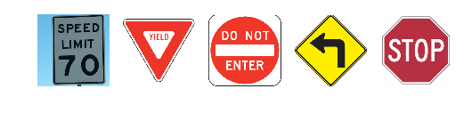

I have taken these US traffic signs from the web. The stop sign looks fairly easy. No entry and yield signs look similar to German counterparts, although there are some differences too, namely the text on the signs. The speed limit sign looks very different from the corresponding German speed-limit sign, the only similarity being the number '70'. The left turn sign is completely different. So, I don't expect classifier to work on the left turn sign and possibly also fail on the speed limit sign.  

Here are the predictions of my CNN classifier :
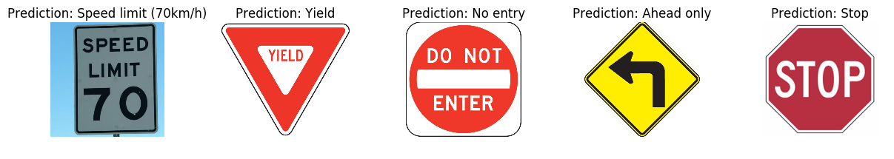

This is actually better that what I had anticipated, my classifier worked even on the speed limit which looked very different from the German sign.

Below I visualize the softmax probablities for each test image :
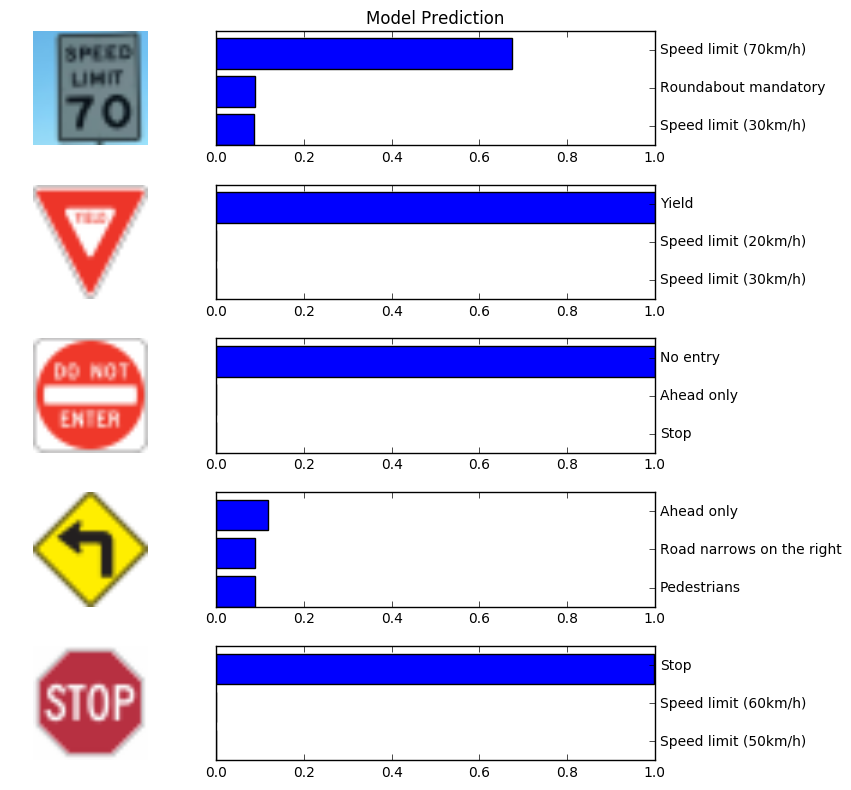

As can be seen above, my classifier predicts stop, yield and no-entry signs with a near 100% certainty. For the speed limit sign, it predicts the correct answer but with a lower probability of about 67%. For the left-turn sign, classifier is very uncertain with the best prediction barely over 10% certain and the correct prediction doesn't appear in the top 3.

--
 

